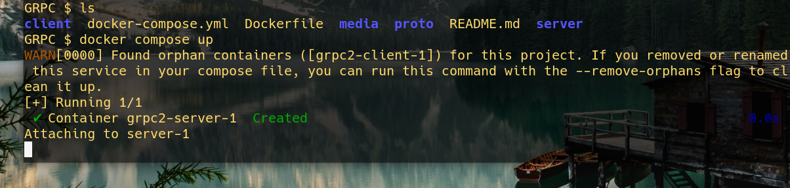
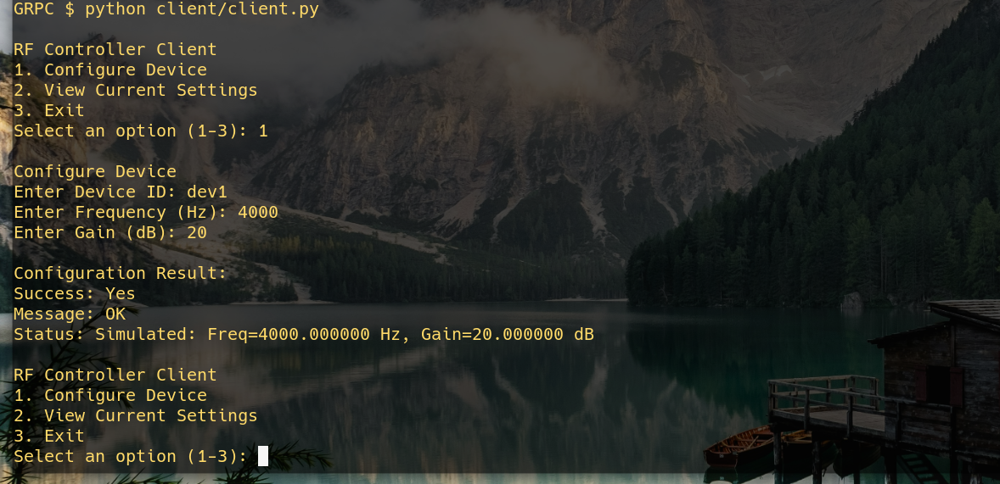

# Overview
A gRPC based server–client project that simulates controlling RF equipment using VISA. The server is written in C++, while the client is in Python, to demonstrate language agnostic interoperability.

---
## 🔍 Overview

- **gRPC Server (C++)**  
  Hosts the RF “equipment” logic.  
  - **VISA Integration**:  
    - Real Hardware Mode (uses actual VISA libraries)  
    - Simulation Mode (in-memory device state; auto-fall-back when VISA can not connect)  

- **Python Client**  
  Interactive CLI for configuring and querying RF devices over gRPC.

---


## ✨ Features

- **Configure RF Parameters**  
  Set device frequency (Hz) and gain (dB) via gRPC calls.  
- **Query Device Status**  
  Retrieve current settings and operational status.  
- **Simulation Mode**  
  Automatic when VISA libraries are missing—logs commands and holds state in memory.

---

## 🛠️ Requirements

- Docker & Docker Compose ≥ 28.0.1  
- Python ≥ 3.10.12  
- GCC ≥ 11.4.0  

---


## 🚀 Quick Start (For linux based OS)

1. **Clone the repository**  
   ```bash
   git clone https://github.com/ta1n/simple-grpc.git
   cd simple-grpc
   ```

2. Run the Server

```bash
docker compose up --build
```

  This will:

    Build and launch the C++ gRPC server

    Expose the server on the configured gRPC port




3. Run the client 
In a new terminal (inside the project root):

```bash
python client/client.py

```



### Using the Client Interface

**When attached to the client container, you'll see an interactive menu:**

```
RF Controller Client
1. Configure Device
2. View Current Settings
3. Exit
Select an option (1-3): 

```

```
Select an option (1-3): 1
Enter Device ID: USRP1
Enter Frequency (Hz): 2.4e9  
Enter Gain (dB): 30

Configuration Result:
Success: Yes
Message: OK
Status: Configured - Freq=2.4 GHz, Gain=30 dB
```

**Sample Query:**

```
Select an option (1-3): 2
Enter Device ID to query: USRP1

Current Device Settings:
Device ID: USRP1
Frequency: 2400000000.0 Hz
Gain: 30.0 dB
Status: Device active

```


## NI-Visa Integration

### Real Device and simulation mode
Code need to be implemented to use a real device, here a simple simulation of command has been done.

Constructor & Mode Selection
```cpp
VISAHandler::VISAHandler()
  : resource_manager(0),
    device_session(0),
    use_simulation(true),
    current_freq(0),
    current_gain(0)
{
    // Try to open the VISA Resource Manager
    if (viOpenDefaultRM(&resource_manager) != VI_SUCCESS) {
        std::cerr << "Using simulation mode\n";
        use_simulation = true;
    }
}
```


- To Set RF frequency via a custom command, we used SetRFSettings. 

- To simulate standard SCPI query `*IDN?` we used GetCurrentSettings which returns the device/equipment info 
that is configured via SetRFSettings. 


### Service in rfcontrol.proto:

```proto
service RFController {
    rpc SetRFSettings (RFConfig) returns (RFResponse) {}
    rpc GetCurrentSettings (DeviceQuery) returns (CurrentSettings) {}
}
```


